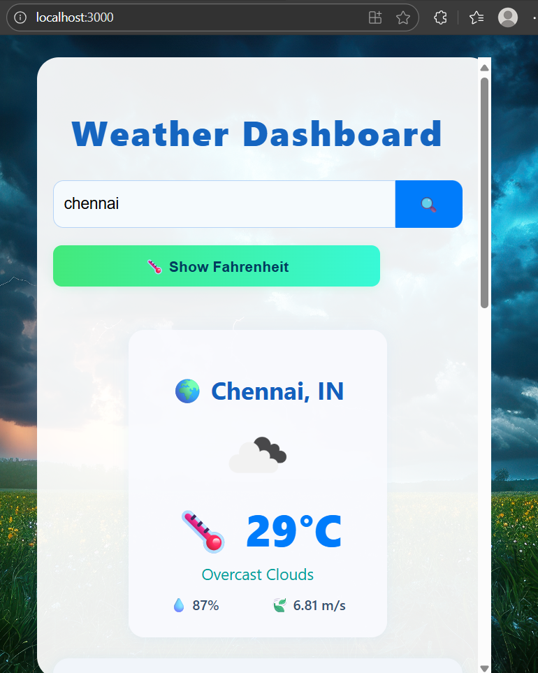
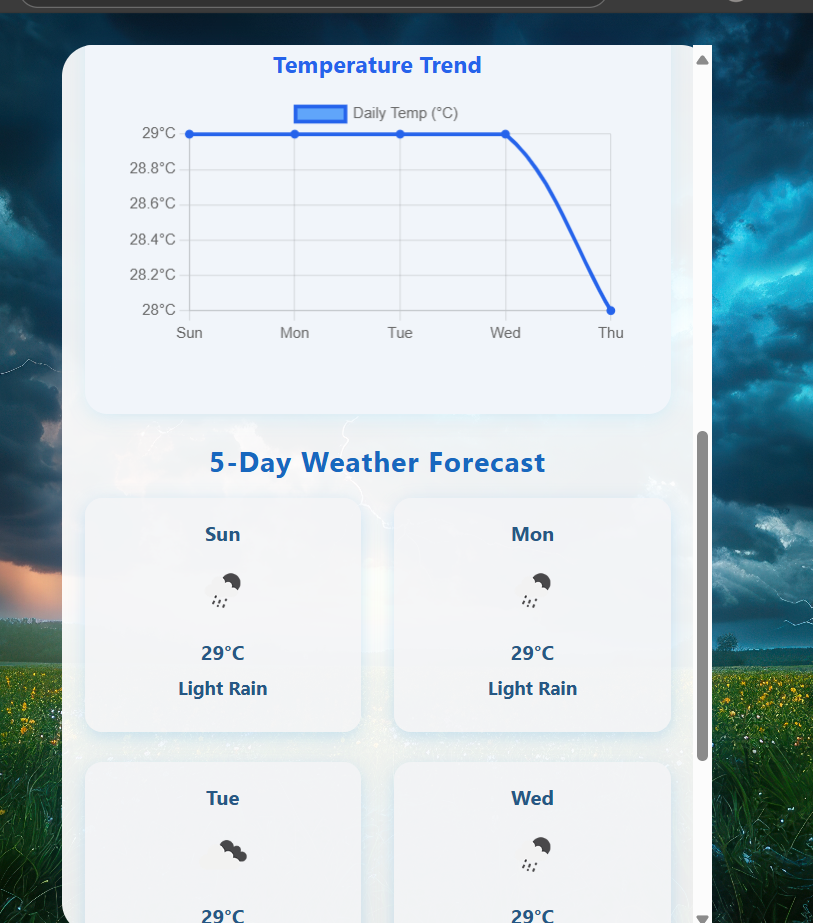

# 🌦️ Weather Dashboard App

A responsive, interactive, and visually engaging **React-based Weather Dashboard** that provides real-time weather updates and a 5-day forecast using the [OpenWeatherMap API](https://openweathermap.org/api).

---

## 🎯 Project Objectives

The goal of this project is to create a **user-friendly weather dashboard** that demonstrates:
- Real-time API data fetching and display  
- Interactive data visualization using charts  
- Responsive and modern UI with dynamic styling  
- Clean React component architecture using hooks  
- Local data persistence using `localStorage`  

This project aims to help users quickly check the current weather and 5-day forecast for any city in the world — all in one place.

---

## 🧩 Tech Stack

### 💻 Frontend
- **React.js** – component-based UI library  
- **Axios** – for handling HTTP requests  
- **CSS (Flexbox)** – responsive layout and styling  
- **Chart.js / Recharts** (via `WeatherTrendChart.js`) – for visual weather trends  

### 🌐 APIs
- **OpenWeatherMap API**  
  - `/data/2.5/weather` – Current weather data  
  - `/data/2.5/forecast` – 5-day weather forecast  

### 🗄️ Data Handling
- **LocalStorage** – stores the last searched city for persistence  

### 🧰 Tooling
- **npm / Node.js** – package management and local development  
- **Create React App (CRA)** – base app structure  

---

## ⚙️ Implementation Details

### 🧠 App Overview
The application is composed of modular React components with a focus on clarity, reusability, and performance.

1. **Main Component – `App.js`**
   - Handles state management for:
     - `city`
     - `units` (Celsius/Fahrenheit)
     - `weather` (current conditions)
     - `forecast` (5-day data)
     - `error` handling
   - Fetches data from OpenWeatherMap using Axios.
   - Saves the last searched city to `localStorage`.

2. **Chart Component – `WeatherTrendChart.js`**
   - Visualizes 5-day temperature data in a responsive line chart.
   - Updates dynamically when city or unit changes.

3. **Styling – `App.css`**
   - Implements a clean, modern UI with a weather-themed background.
   - Uses Flexbox and media queries for mobile responsiveness.

4. **Background – `weather-bg.jpg`**
   - Provides a consistent aesthetic across devices.

---

## Screenshot:

